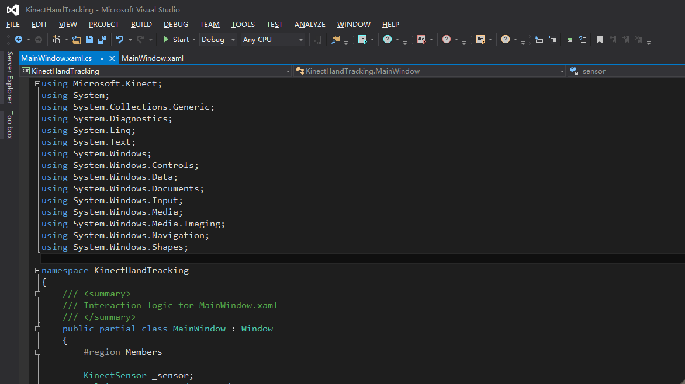
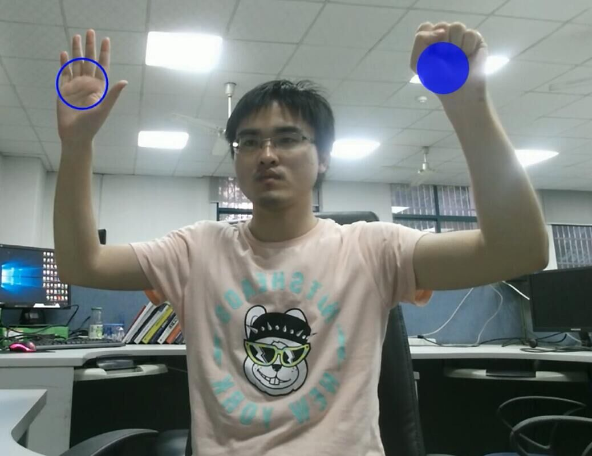

KinectHandTracking
==================

利用 Kinect v2 进行 Hand Tracking 实验。

## 实验环境

- Windows 10 x64
- Kinect v2 设备及其 Kinect SDK 开发包
- USB 3.0 接口支持
- Visual Studio 2013 C# 开发环境

## 代码编写

实验代码由 C# 编写了一个 WPF 窗口应用，通过 Kinect SDK 获取设备捕获到的彩色帧数据和深度帧数据。Kinect SDK 提供了人体骨架追踪接口，我们可以在此基础上定位追踪人手。由于 Kinect 的彩色摄像头和深度摄像头并不处在空间的同一位置，所以深度帧和彩色帧之间坐标点要经过变换才能够做相应的映射。定位到手的位置之后，我们将坐标从深度帧上转换到彩色帧，然后在彩色图上画上相应的标记，生成的图像将被绘制到 canvas 空间做显示。

## 如何运行

1. 需要 Kinect 2 sheb
2. 安装 [Kinect SDK](https://developer.microsoft.com/en-us/windows/kinect)
3. 安装 [Visual Studio](https://www.visualstudio.com/)
4. 下载代码 `git clone git@github.com:NanYANG2015/3D-Hand-Tracking.git`
5. 打开 KinectHandTracking/KinectHandTracking.sln 编译运行代码

## 运行截图

