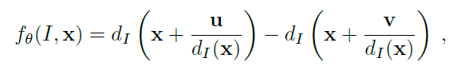

# 3D Hand Tracking

## Introduction

In the field of image processing, hand/finger tracking is a high-resolution technique that is employed to know the consecutive position of the hands/fingers of the user and hence represent objects in 3D. In addition to that, the hand/finger tracking technique is used as a tool of the computer, acting as an external device in our computer, similar to a keyboard and a mouse.

## Device Support

Microsoft Kinect is a device to capture not only the color information of the environment but also the depth information. With the support of Kinect using the depth camera, we can tracking and recognize human hands by color and depth information.

## Brief

We will use Microsoft Kinect v2 for this project. Detecting the human hand in a real time environment should be the baseline of this project. More feature will be considered and added if we have enough time.

## Progress

- Install Kinect v2 SDK and development environment is Done and Test the environment is Done. 2016-05-26

## paper reading

### Real-Time Human Pose Recognition in Parts from Single Depth Images

这篇论文是 Kinect 设备利用深度帧数据来获取人体骨架方法的基础，论文提出了高效实时的方法，从单个深度帧上进行人体各关节的定位检测。论文提出的方法可以在消费级硬件的水平上达到 200 帧每秒的速度，效率非常惊人。

论文提出的方法主要将人体抽象分割成多个部分，在深度帧的每个像素点上预测该像素点属于人体每个部位的概率，然后再在整个深度帧的基础上联合 proposal 人体的各个部位，从整体上给出人体各个部位的检测结果。论文的分割方法是基于像素级的分割。论文的主要贡献在于将人体姿态估计问题转换成了识别问题，提出了新的方法，将人体分为若干个部分进行识别预测，在联合起来检测整个人体。

论文中的相关工作提到了有 ICP 的方法在固定人体大小和初始姿态的条件下做人体姿态估计，也有方法讲 3D 环境下的木偶分成头肢体和躯干还有背景来对深度帧进行分割。还有相关工作在人体初始 T 姿态下，利用线性规划的方法对人上半身的头，躯干和手臂进行分割。但是这些方法要不就是精度不行，鲁棒性差，条件苛刻，要不就是速度不行，论文因此提出了高效鲁棒的算法来进行人体骨架检测。

论文提到训练数据是一个大问题，论文作者采用了计算机图形学的方法来产生 3D 人体姿态训练数据。但是这样的方法是存在缺陷的，论文提到生成的 3D 人体数据缺少色彩和纹理信息，尤其是人的头发，肤色，衣服上体现的尤为明显，虽然深度摄像头可以减少它们的影响，但是衣服着装上的形状纹理依然会有所影响。其次，生成的数据也缺少人体在摄像头下复杂的姿态动作。论文因此提出了一种方法，在动作摄像头捕捉到几个角色的若干个基础姿态后，通过计算机图形学的方法在此基础上生成巨量的训练数据，以解决上述两个问题。

##### Body Part Inference and Joint Proposals

论文通过人体部位中间概率表示来做联合预测。需要事先定义好若干个部分来覆盖整个人体，这些部分相互具有联系，还可以联合若干个部分来预测其他部位。论文同时提出了一种非常简单的针对深度图的特征提取方式，可以用如下公式和图来表示

论文在深度图上的点，在点的周围选取两个点按照上述公式来提取特征。同时通过随机决策树来做分类，预测每个部位的概率。从深度图上枚举 2000 个点争取覆盖到人体的各个部分，然后通过随机决策树来进行分类，论文提到，训练 3 个随机树，树的深度在 20，训练数据一百万的图像，在 1000 核的集群上需要训练一天。

做完像素级的预测之后，论文需要联合这些概率做整体预测。论文提出最简单的方法就是直接利用预测得到的部位的中心来表示人体的部位，但是这种方法会受到异常点的影响，于是，论文提出了人体部位的密度估计，通过 mean-shift 方法，在实际点和真实点之间，利用预测点的深度值，并加上一定的权值来计算，同时通过数据来训练参数 `b`。

## Project

我们利用 Kinect 设备做了这次 Project。利用 Kinect SDK 提供的功能，通过人体骨架追踪来定位跟踪人的手，同时 Kinect SDK 还提供了检测手状态的接口，可以获取手张开和闭合的状态。为了方便代码的编写和与 Kinect 的交互，我们 C# 写了这次 Project 的代码，代码都在 [`KinectHandTracking`](KinectHandTracking) 下，需要 Kinect 设备和安装 Kinect SDK 才能运行。程序运行时的截图如下。

蓝色空心圈表示检测到了手的位置，同时手处于张开状态，蓝色实心圈则表示手处于闭合状态。实验视频将在课堂上做演示。

## References

- Fast and Robust Hand Tracking Using Detection-Guided Optimization, In CVPR, 2015.
- Accurate, Robust, and Flexible Real-time Hand Tracking, In CHI, 2015.
- Full DOF tracking of a hand interaction with an object by modeling occlusions and physical constraints, In ICCV, 2011.
- Real-Time Human Pose Recognition in Parts from Single Depth Images, In CVPR, 2011.

## Group Members

杨楠 - yangnan@hust.edu.cn

张杰 - luoyetx@gmail.com

谢锋 - xiefenghust@gmail.com
